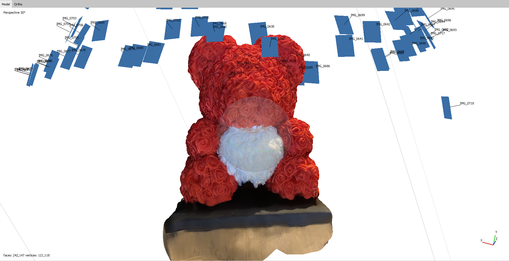
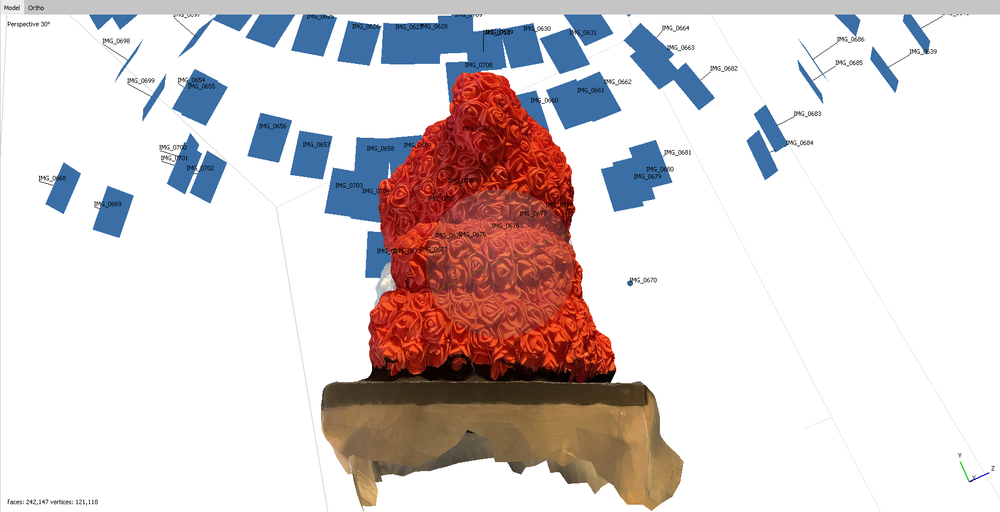
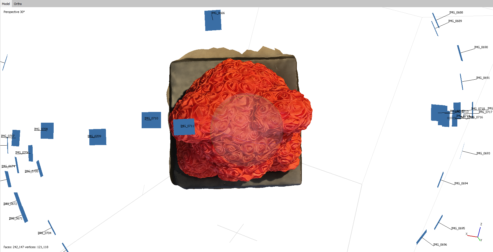
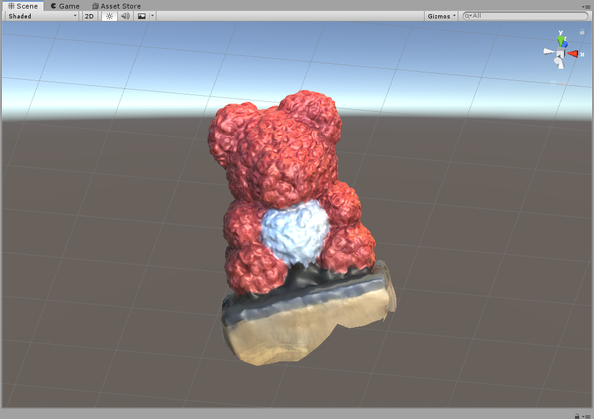
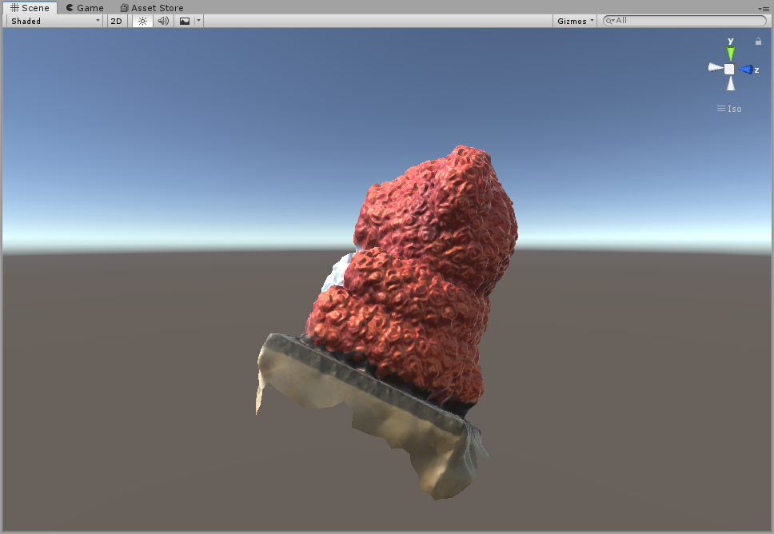
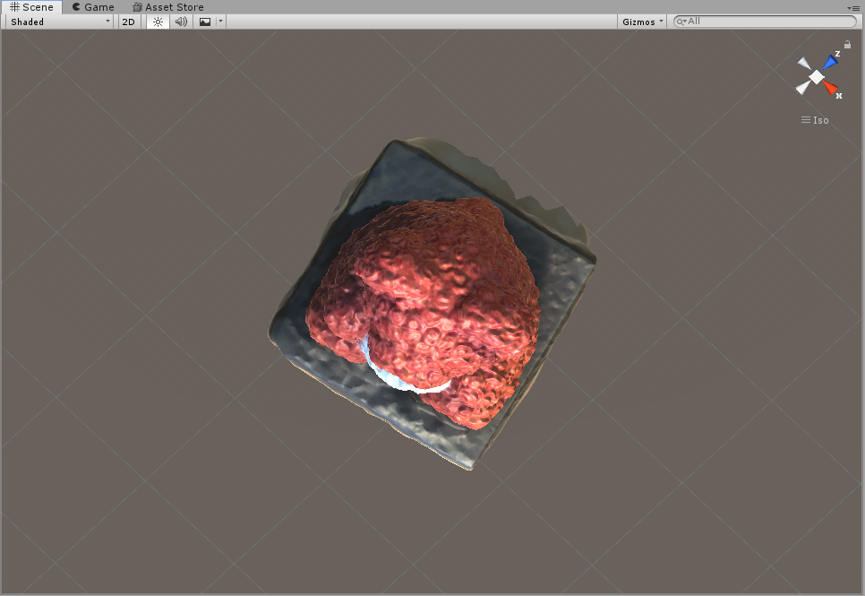

# Creating Virtual Reality based on Structure-from-Motion

**Author:** Jou Ho
**Contact:** jouh@uw.edu

In this small project, I tried to make a virtual reality scene through structure-from-motion (SfM).VR has been slowly beginning to show promising functionalities in the field of geography, as well as public health, videogame industry, military training, and informatics management. For this practice, I will go over how I made an adorable teddy bear 3D model from scratch. More detailed tutorial on how to make 3D model using SfM can be found [here](https://github.com/jakobzhao/geog595/blob/master/07_vr/pe.md).

First, I took a series of picture of my adorable teddy bear from many different angle. For the first time I was making a 3D model, it did not generate a detailed model with just 50 pictures. So I took at least 150 pictures. I aligned all the photos in a tool called `Agisoft`. I then created point clouds and polygon mesh using the same photos. After several minutes. Below is the result I got:

As you can see, the bear is made out of hundreds of roses and we can learn how accurate photo scanning can be.

After exporting the model to unity, they look like below:

Since a scene in unity can contain environmental variable such as light source, the lighting is a bit different and coloring is more pale. It was also hard to deal with the orientation of the object. However there are a lot of application to this technology and it was a fun experience for myself as well!
